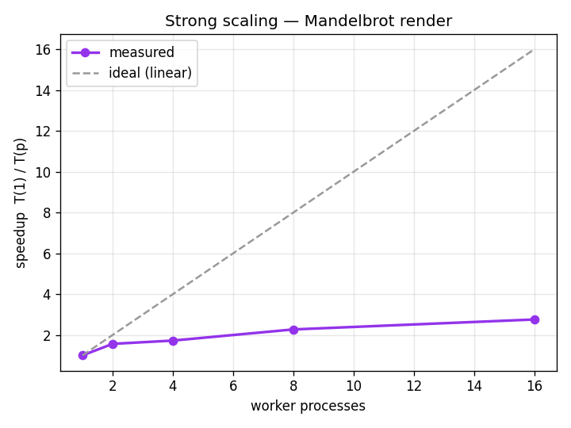
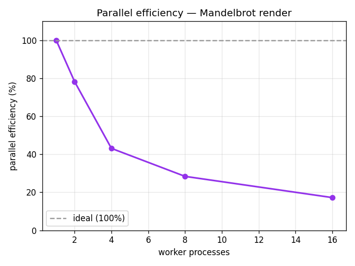
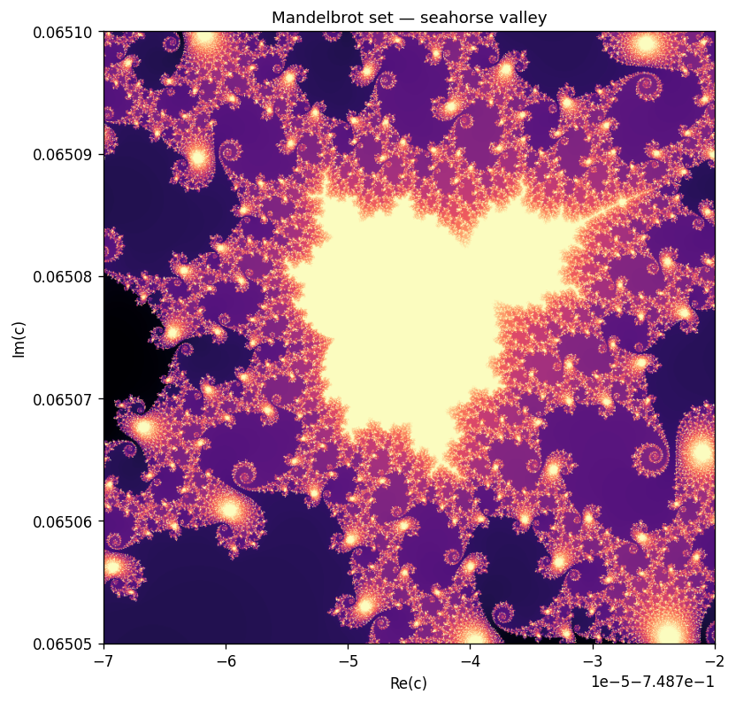

# hpc-final-project

Take one genuinely compute-heavy workload, optimise it, parallelise it across
CPU cores, and **prove** the speedup with real benchmarks — profiling, a strong-
scaling study, and correctness checks against a reference implementation.

The workload is **Mandelbrot escape-time rendering**. For every pixel `c` of a
complex-plane grid we iterate `z → z² + c` until `|z| > 2` and record how many
steps it took. It is embarrassingly parallel (pixels are independent) but the
per-pixel cost is wildly uneven — points inside the set run the full iteration
budget — which makes it a clean, honest subject for a scaling study.

> Scope note: this is a **single-node, multi-core** study. "Many nodes" (a real
> cluster with MPI) is out of scope for one laptop; the decomposition used here
> maps directly onto MPI, and how is spelled out at the bottom.

- **Live site:** https://andreaisabelmontana.github.io/hpc-final-project/
- **Index of all my builds:** https://andreaisabelmontana.github.io/coursework-rebuilds/

## The implementations

All kernels take the same `MandelbrotView` and return the **same** `int32`
array of iteration counts. Because the answer is identical, every speedup is a
real win and not a change of result (verified in the test suite).

| Kernel | File | How |
|---|---|---|
| `mandelbrot_naive` | `hpc/mandelbrot.py` | Pure-Python double loop over pixels — the reference. |
| `mandelbrot_numpy` | `hpc/mandelbrot.py` | One vectorized NumPy pass over the whole grid. |
| `mandelbrot_parallel` | `hpc/mandelbrot.py` | `multiprocessing`: split the rows into bands, run the NumPy kernel per band in its own process, stitch back. |
| `mandelbrot_numba` | `hpc/mandelbrot.py` | Optional JIT (`@njit(parallel=True)`) — enabled automatically if `numba` is installed. |

## Profiling — find the hotspot first

`hpc/profiling.py` runs `cProfile` on the naive kernel. The result is
unambiguous: essentially **100% of the time is inside `mandelbrot_naive`** — the
per-pixel escape loop — and that is exactly the function the other kernels
replace.

```
   ncalls  tottime  percall  cumtime  percall filename:lineno(function)
        1    0.588    0.588    0.588    0.588 hpc/mandelbrot.py:80(mandelbrot_naive)
        2    0.000    ...                      numpy .../function_base.py:24(linspace)
>>> Hotspot (most self-time): mandelbrot_naive
```

## Strong-scaling results (real, measured)

Machine: **16 logical CPUs**. The scaling study fixes the problem size
(800×800 pixels, `max_iter=1000`) and increases the number of worker processes,
taking the best of 3 runs at each count after a warmup pass (so process spawn /
import cost is excluded from the steady-state numbers).

`speedup(p) = T(1) / T(p)` · `efficiency(p) = speedup(p) / p`

| workers | time (s) | speedup | efficiency |
|--------:|---------:|--------:|-----------:|
| 1  | 23.867 | 1.00x | 100.0% |
| 2  | 15.256 | 1.56x |  78.2% |
| 4  | 13.838 | 1.72x |  43.1% |
| 8  | 10.507 | 2.27x |  28.4% |
| 16 |  8.652 | 2.76x |  17.2% |




**Reading the curve honestly.** Speedup is real (2.76x on 16 cores) but plainly
sub-linear, and efficiency collapses as cores are added. This is Amdahl's law in
the wild: the un-parallelisable part of *this* setup — spawning processes,
pickling each result band back to the parent, and the final `vstack` — is fixed
overhead that a fast NumPy kernel finishes in seconds, so adding more processes
quickly hits diminishing returns. On Windows the only portable start method is
`spawn`, whose per-process cost is high, which is why the knee is early.

### Implementation comparison (400×400, `max_iter=400`)

| kernel | time (s) | vs naive |
|---|---:|---:|
| naive (pure Python) | 8.074 | 1.0x |
| numpy (vectorized)  | 2.220 | 3.6x |
| parallel (16 cores) | 2.529 | 3.2x |
| numba (JIT, threads)| 0.008 | 1021x |

The honest punchline: **vectorisation is the big win**, and on this size the
multiprocessing version barely matches single-process NumPy because spawn
overhead eats the gain — multiprocessing only pulls ahead on the larger
scaling instance above. Numba's in-process JIT avoids all process overhead and
wins by three orders of magnitude — the right tool when you can use it.

## Run it

```bash
pip install -r requirements.txt          # numpy, matplotlib, pytest (numba optional)
python -m pytest -q                       # 11 tests: correctness + scaling harness
python benchmark.py                       # profiling + scaling table + figures/
python demo.py                            # renders figures/mandelbrot.png
```

`python -m pytest -q`:

```
...........                                                              [100%]
11 passed
```

The tests assert that the vectorized and parallel kernels reproduce the naive
reference **exactly** (iteration counts are integers, so equality is exact),
including for grid sizes and worker counts that do not divide evenly; that the
profiler names the right hotspot; that the scaling harness returns one point per
worker count with a baseline speedup of exactly 1.0; and that 2 workers beat 1
on a large instance (warmed up + best-of timing to stay robust against noise).

## Output



A zoom into the seahorse-valley boundary (`max_iter=1000`), rendered with the
parallel kernel. Identical, pixel for pixel, to the naive reference.

## How this extends to MPI (multi-node)

The decomposition here is already the distributed one: the image is split into
horizontal row-bands, each computed independently, then concatenated. Going from
`multiprocessing` on one node to MPI across many is a mechanical change:

- **Domain decomposition** — give MPI rank *r* of *n* its slice of rows (the
  same `np.array_split` logic).
- **No halo exchange** — pixels are independent, so unlike a stencil/PDE solver
  there is *zero* communication during compute; only the final gather matters.
- **Gather** — replace `pool.map(...)` + `vstack` with `comm.Gatherv` to collect
  bands onto rank 0.

The lesson would carry over too: communication is cheap here (one gather), so
the ceiling is set by load imbalance — a naive equal-rows split gives some ranks
mostly-interior (expensive) rows. A real multi-node version would hand out
smaller row-chunks dynamically to balance the uneven per-pixel cost.

## Built with

Python 3.12, NumPy, `multiprocessing`, matplotlib, optional numba; pytest for
the test suite. No external services.
